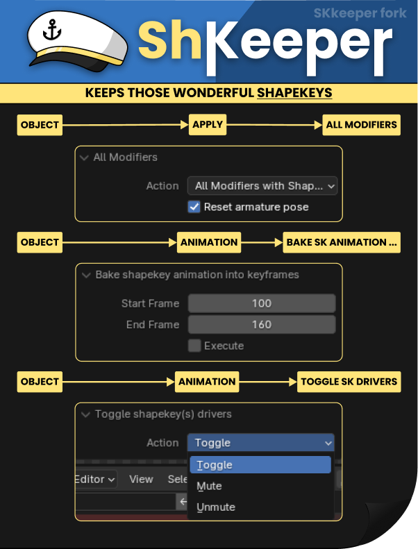

# Blender Addon - SKkeeper

ShKeeper is a Blender add-on designed to manage shape keys and modifiers efficiently. It allows you to apply modifiers while preserving shape keys, bake shape key animations, and toggle shape key drivers.

## How to Install

Download the zipfile from the [Releases page](https://github.com/agitoreiken/shkeeper/releases) and install via Blenders Addon-Preferences

Edit > Preferences > Add-ons > Install... > Select ShKeeper.zip
 
## Features

### 1. Apply Modifiers
Applies all modifiers to selected mesh objects while optionally preserving shape keys.

- **Location:** Object > Apply > All Modifiers
- **How to Use:**
  1. Select the mesh objects.
  2. Go to `Object > Apply > All Modifiers`.
  3. Choose whether to apply all modifiers or retain shape keys.
  4. Optionally, reset the armature pose.

### 2. Bake Shape Key Animation
Bakes shape key animations into keyframes for selected mesh objects.

- **Location:** Object > Animation > Bake Shape Key Animation
- **How to Use:**
  1. Select mesh objects with shape keys.
  2. Go to `Object > Animation > Bake Shape Key Animation`.
  3. Set the start and end frames.
  4. Execute the bake operation.

### 3. Toggle Shape Key Drivers
Toggles, mutes, or unmutes drivers on shape keys for selected mesh objects.

- **Location:** Object > Animation > Toggle Shape Key Drivers
- **How to Use:**
  1. Select mesh objects with shape keys.
  2. Go to `Object > Animation > Toggle Shape Key Drivers`.
  3. Choose the action (Toggle, Mute, Unmute).
  4. Execute the operation.
